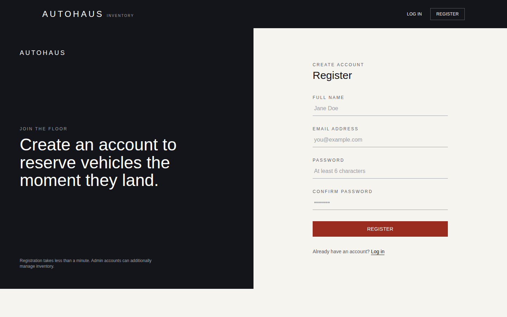

# AutoHaus — Car Dealership Inventory System

A full-stack Car Dealership Inventory System built for the **TDD Kata**. Users can browse, search, and
purchase vehicles; administrators can add, edit, delete, and restock inventory. The backend is a
JWT-secured REST API backed by MongoDB, and the frontend is a React (Vite) single-page application
styled with Tailwind CSS.


---

## Table of contents

- [Project overview](#project-overview)
- [Tech stack](#tech-stack)
- [Architecture & design decisions](#architecture--design-decisions)
- [Project structure](#project-structure)
- [Getting started](#getting-started)
- [API reference](#api-reference)
- [Testing & test report](#testing--test-report)
- [Screenshots](#screenshots)
- [My AI Usage](#my-ai-usage)

---

## Project overview

AutoHaus is split into two independently runnable projects:

- **`backend/`** — an Express + MongoDB REST API that owns authentication, authorization, and all
  vehicle inventory logic.
- **`frontend/`** — a React SPA that consumes that API: registration/login, a searchable vehicle
  dashboard, one-click purchasing, and an admin-only inventory management UI.

Every vehicle has a unique ID, `make`, `model`, `category`, `price`, and `quantity` in stock, exactly as
specified in the kata. Purchases decrement quantity (and are rejected once stock hits zero); restocks
(admin-only) increase it.

## Tech stack

| Layer | Choice |
|---|---|
| Backend runtime | Node.js + Express |
| Database | MongoDB + Mongoose |
| Auth | JWT (`jsonwebtoken`) + `bcryptjs` password hashing |
| Backend testing | Jest + Supertest + `mongodb-memory-server` |
| Frontend | React 18 (Vite) |
| Styling | Tailwind CSS (custom design system) |
| Routing / HTTP | React Router + Axios |

> **Why `bcryptjs` instead of `bcrypt`?** `bcryptjs` is a pure-JavaScript, API-compatible implementation.
> It avoids native compilation (`node-gyp`) entirely, which keeps `npm install` fast and reliable across
> platforms/CI. Swapping back to `bcrypt` requires no code changes beyond the import.

## Architecture & design decisions

- **Layered backend (SOLID-friendly):** `routes` → `controllers` → `models`, with cross-cutting concerns
  (`auth`, `adminOnly`, centralized `errorHandler`) as composable middleware. Each controller function has
  one job; authorization is a separate middleware from authentication so routes can mix "must be logged
  in" and "must be an admin" independently (single responsibility, open/closed for new roles later).
- **`app.js` vs `server.js`:** the Express app is assembled in `app.js` with no side effects (no DB
  connection, no `listen()`), while `server.js` owns process-level concerns. This means Supertest can
  import the app directly in tests without a real network port or a live server process — a deliberate
  testability decision.
- **Custom `ApiError` + one error-handling middleware:** controllers `throw new ApiError(statusCode,
  message)` and forward to `next(err)`. A single `errorHandler` translates that (plus Mongoose validation/
  cast/duplicate-key errors) into a consistent JSON shape, so no controller repeats try/catch
  boilerplate for formatting responses.
- **Stock-safety is enforced server-side:** `purchaseVehicle` re-reads the current quantity and rejects
  (`409 Conflict`) if the requested amount exceeds it — quantity can never go negative, regardless of what
  the client sends.
- **JWT payload carries the role:** the token embeds `{ id, role }` so `adminOnly` can authorize without an
  extra DB round-trip on every protected request.
- **Frontend state:** a small `AuthContext` wraps `localStorage` (token + user) and exposes
  `login/register/logout/isAdmin`. `ProtectedRoute` is the single place that decides "is anyone allowed to
  see this page," rather than scattering `if (!user)` checks across pages.
- **One vehicle form, two modes:** `VehicleFormModal` handles both "add" and "edit" (the only difference is
  whether a `vehicle` prop is passed in), avoiding a near-duplicate second component.

## Project structure

```
car-dealership-inventory-system/
├── backend/
│   ├── src/
│   │   ├── config/db.js              # Mongoose connection
│   │   ├── models/                   # User, Vehicle schemas
│   │   ├── middleware/               # auth (JWT), admin (RBAC), errorHandler
│   │   ├── controllers/              # authController, vehicleController
│   │   ├── routes/                   # authRoutes, vehicleRoutes
│   │   ├── utils/                    # generateToken, ApiError
│   │   ├── app.js                    # Express app (no side effects — testable)
│   │   └── server.js                 # connects DB, then starts listening
│   ├── tests/
│   │   ├── unit/                     # controllers tested with mocked models (no DB needed)
│   │   ├── integration/              # Supertest + real in-memory Mongo (needs internet on first run)
│   │   └── setup/                    # mongodb-memory-server helpers
│   ├── .env.example
│   └── package.json
├── frontend/
│   ├── src/
│   │   ├── api/axiosClient.js        # baseURL + JWT interceptor
│   │   ├── context/AuthContext.jsx
│   │   ├── components/               # Navbar, Footer, VehicleCard, SearchFilterBar,
│   │   │                             # VehicleFormModal, RestockModal, ProtectedRoute
│   │   ├── pages/                    # Login, Register, Dashboard
│   │   ├── App.jsx / main.jsx
│   │   └── index.css                 # Tailwind + design tokens
│   ├── tailwind.config.js
│   └── package.json
├── docs/screenshots/
├── PROMPTS.md
└── README.md
```

## Getting started

### Prerequisites

- Node.js 18+
- A MongoDB instance — local (`mongod`) or a free [MongoDB Atlas](https://www.mongodb.com/atlas) cluster

### 1. Backend

```bash
cd backend
cp .env.example .env      # then edit MONGO_URI / JWT_SECRET
npm install
npm run dev                # starts on http://localhost:5000
```

`.env` variables:

```
PORT=5000
MONGO_URI=mongodb://127.0.0.1:27017/car_dealership
JWT_SECRET=replace_this_with_a_long_random_string
JWT_EXPIRES_IN=7d
NODE_ENV=development
```

### 2. Frontend

```bash
cd frontend
cp .env.example .env       # VITE_API_BASE_URL=http://localhost:5000/api
npm install
npm run dev                 # starts on http://localhost:5173
```

Open `http://localhost:5173`, register an account, and start browsing. To try the admin experience,
register a second account and manually set its `role` field to `"admin"` in MongoDB (this keeps
privilege escalation out of the public registration form, by design).

## API reference

All `/api/vehicles*` routes require `Authorization: Bearer <token>`. Admin-only routes are marked.

| Method | Endpoint | Description | Access |
|---|---|---|---|
| POST | `/api/auth/register` | Create an account | Public |
| POST | `/api/auth/login` | Log in, receive a JWT | Public |
| GET | `/api/vehicles` | List all vehicles | Authenticated |
| GET | `/api/vehicles/search?make=&model=&category=&minPrice=&maxPrice=` | Filtered search | Authenticated |
| GET | `/api/vehicles/:id` | Get one vehicle | Authenticated |
| POST | `/api/vehicles` | Add a vehicle | Authenticated |
| PUT | `/api/vehicles/:id` | Update a vehicle | Authenticated |
| DELETE | `/api/vehicles/:id` | Delete a vehicle | **Admin** |
| POST | `/api/vehicles/:id/purchase` | Purchase (decrements stock) | Authenticated |
| POST | `/api/vehicles/:id/restock` | Restock (increments stock) | **Admin** |

## Testing & test report

Tests follow a **Red → Green → Refactor** flow and are split into two layers:

- **Unit tests** (`tests/unit`) — controllers tested against manually-mocked Mongoose models. These run
  instantly, need no database or network access, and are the fastest feedback loop for business logic
  (e.g. "purchasing more than available stock is rejected with 409 and never mutates quantity").
- **Integration tests** (`tests/integration`) — Supertest hitting the real Express `app` against a real,
  ephemeral MongoDB instance spun up by `mongodb-memory-server`. These exercise routing, middleware,
  validation, and persistence end-to-end. (First run downloads a local `mongod` binary, so it needs
  internet access once; it's cached afterwards.)

```bash
cd backend
npm run test:unit          # fast, no DB required
npm run test:integration   # full Supertest + in-memory MongoDB
npm test                   # everything
npm run test:coverage      # coverage report
```

### Actual test report (unit suite, captured from this repository)

```
PASS tests/unit/auth.controller.test.js
  authController (unit, mocked model)
    register
      ✓ creates a user and returns 201 with a token (5 ms)
      ✓ rejects registration when a field is missing (1 ms)
      ✓ rejects registration for a duplicate email (1 ms)
      ✓ never assigns the admin role unless explicitly requested (1 ms)
    login
      ✓ logs in successfully with correct credentials (1 ms)
      ✓ rejects login for a non-existent user
      ✓ rejects login for an incorrect password

PASS tests/unit/vehicle.controller.test.js
  vehicleController (unit, mocked model)
    createVehicle
      ✓ creates a vehicle and responds with 201 (1 ms)
      ✓ calls next with an error when required fields are missing
    getVehicles
      ✓ returns every vehicle when no filter is supplied (1 ms)
      ✓ applies the inStockOnly filter
    purchaseVehicle
      ✓ decrements quantity by 1 when enough stock exists
      ✓ rejects the purchase when quantity requested exceeds stock (14 ms)
      ✓ never lets stock go below zero
      ✓ passes a 404 error to next when the vehicle does not exist
    restockVehicle
      ✓ increases quantity by the requested amount (1 ms)
      ✓ defaults to increasing by 1 when no quantity is provided
      ✓ rejects a zero or negative restock amount (1 ms)
    deleteVehicle
      ✓ deletes an existing vehicle (1 ms)
      ✓ passes a 404 to next if the vehicle is not found

Test Suites: 2 passed, 2 total
Tests:       20 passed, 20 total
```

The `tests/integration` suite (23 additional test cases covering the full HTTP surface — registration,
login, every vehicle CRUD route, search filters, purchase/restock edge cases, and RBAC) runs against a
real MongoDB instance and is included in the repo; run `npm run test:integration` locally to execute it
against a live/in-memory database.

## Screenshots

| Login | Register |
|---|---|
|  |  |

| Dashboard |
|---|
|  |

## My AI Usage

**Tools used:** Claude (Anthropic), used directly in an agentic coding environment with file system and
test-execution access for this entire project.

**How I used it:**

- **Requirements extraction:** I had Claude read the assignment document directly (via `pandoc`) rather
  than working from a paraphrase, to make sure every literal requirement (exact endpoint paths, the
  "admin only" restrictions on delete/restock, the AI co-authorship policy itself) was captured correctly.
- **Backend scaffolding:** Claude generated the initial Express app structure, Mongoose schemas, JWT
  middleware, and controllers from the spec. I reviewed and adjusted the design around it — e.g. splitting
  `app.js` from `server.js` specifically so the app could be tested with Supertest without a live network
  port, and choosing `bcryptjs` over `bcrypt` to avoid native-module install friction.
- **Test-writing (TDD):** Claude wrote both the unit tests (mocked-model, fast) and integration tests
  (Supertest + `mongodb-memory-server`, real DB) covering the required endpoints, including edge cases the
  spec implies but doesn't spell out (e.g. "purchasing must never let quantity go negative," "only an
  admin can restock or delete"). I ran the unit suite myself and iterated with Claude when a Mongoose-model
  auto-mock broke Jest — Claude diagnosed it and switched to explicit factory mocks.
- **Frontend implementation:** Claude built the React component tree (Auth context, protected routing,
  search/filter bar, vehicle cards, add/edit/restock modals) and a Tailwind design system inspired by
  reference screenshots I provided (Range Rover / Tata Motors) — dark "ink" navigation, a warm paper
  background, and a deep "ember" accent color, paired with Oswald/Inter typography.
- **Verification, not just generation:** I had Claude actually run `npm run build` for the frontend and
  `npm test` for the backend inside the sandbox, and use a headless browser to screenshot the running
  login/register/dashboard pages, rather than assuming the generated code worked.
- **Documentation:** This README and `PROMPTS.md` were drafted by Claude and reviewed/edited by me.

**Reflection:** The biggest workflow shift was writing tests and implementation together in one pass while
still keeping them logically separable — Claude proposed the controller behavior and the tests for it side
by side, which made it easy to spot a mismatch immediately (e.g. the mocked-model automock failure) rather
than discovering it later in CI. The main thing I had to actively steer was making sure test coverage
wasn't just "happy path" — I asked explicitly for the negative cases (insufficient stock, non-admin trying
to delete/restock, duplicate email, missing fields) since those are exactly the cases a rushed
implementation tends to skip.
